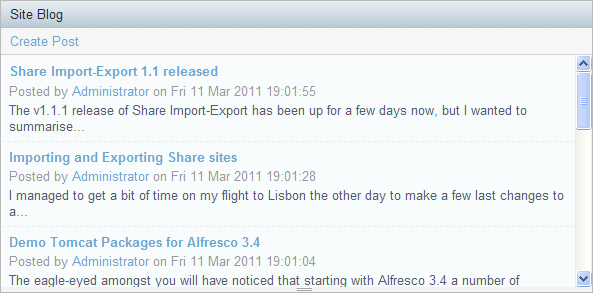

Site Blog Dashlet for Alfresco Share
====================================

Author: Will Abson

This add-on provides a dashlet to display the last ten blog posts and submit new posts from the site dashboard.

The _Create Post_ action provided by the dashlet allows quick and easy creation of new blog posts without leaving the dashboard.

Installation
------------

The dashlet is packaged as a single JAR file for easy installation into Alfresco Share.

To install the dashlet, simply drop the `site-blog-dashlet-<version>.jar` file into the `tomcat/shared/lib` folder within your Alfresco installation, and restart the application server. You might need to create this folder if it does not already exist.

Building from Source
--------------------

An Ant build script is provided to build a JAR file containing the custom files, which can then be installed into the `tomcat/shared/lib` folder of your Alfresco installation.

To build the JAR file, run Ant from the base project directory.

    ant dist-jar

The command should build a JAR file named `site-blog-dashlet-<version>.jar` in the `build/dist` directory within your project, which you can then copy into the `tomcat/shared/lib` folder of your Alfresco installation.

Alternatively, you can use the build script to _hot deploy_ the JAR file directly into a local Tomcat instance for testing. You will need to use the `hotcopy-tomcat-jar` task and set the `tomcat.home` property in Ant.

    ant -Dtomcat.home=C:/Alfresco/tomcat hotcopy-tomcat-jar
    
After you have deployed the JAR file you will need to restart Tomcat to ensure it picks up the custom resources.

Usage
-----

  1. Log in to Alfresco Share and navigate to a site dashboard.
  2. Click the _Customize Dashboard_ button to edit the contents of the dashboard and drag the dashlet into one of the columns from the list of dashlets.